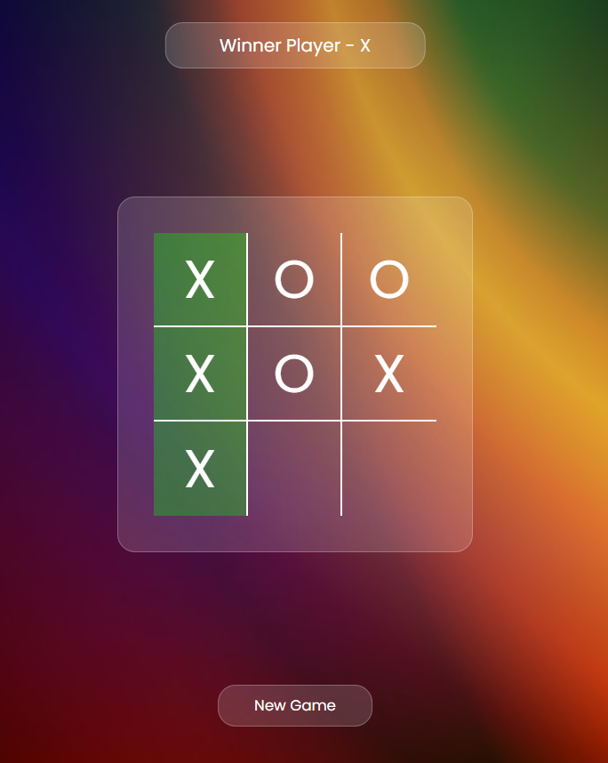

# Tic Tac Toe Game



## Overview

Tic Tac Toe Game is a classic two-player game built for the web. It provides a simple and interactive platform for users to enjoy the timeless Tic Tac Toe experience. The game features a responsive design, making it accessible across various devices.

## How to Play

1. **Start the Game:**
   - Open the index.html file in your preferred web browser.
   - Alternatively, access the live demo [here](#).


2. **Restart:**
   - Click the "New Game" button to reset the game and start a new round.

## Technologies Used

- **HTML:** Structure of the game board.
- **CSS:** Styling and layout design.
- **JavaScript:** Game logic and interactivity.

## Installation

1. Clone the repository:

   ```bash
   git clone https://github.com/your-username/tic-tac-toe.git
   ```

2. Open the `index.html` file in your preferred web browser.

## Customize

Feel free to customize the game further by tweaking the styles or adding additional features. Explore the `style.css` and `script.js` files to make changes according to your preferences.

## License

This project is licensed under the MIT License - see the [LICENSE](LICENSE) file for details.
